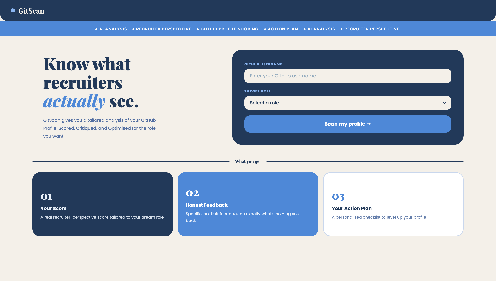

# GitScan

A GitHub profile analyser that tells you what recruiters actually see.

GitScan takes any GitHub username, pulls their public profile and repos via the GitHub API, and runs them through an AI analysis tailored to a specific job role. You get a score, honest feedback on what is holding you back, and a concrete action plan.

---

## Preview



---

## Features

- **Profile Overview** — fetches real GitHub data including bio, repos, languages, followers and account age
- **AI-Powered Scoring** — sends profile data to GPT-3.5 and gets back a structured score across four categories: Documentation Quality, Project Variety, Commit Consistency, and Role Relevance
- **Role-Targeted Analysis** — the analysis changes based on the role you select (Frontend, Backend, ML, DevOps, and more)
- **Action Plan** — generates a personalised checklist of things to fix, specific to that profile
- **Clean UI** — built with a custom design system using Playfair Display and Poppins, no component library

---

## Tech Stack

- React (with React Router v7)
- GitHub REST API (unauthenticated)
- OpenAI API (GPT-3.5 Turbo)
- Plain CSS (no Tailwind, no UI library)

---

## Getting Started

### Prerequisites
- Node.js installed
- An OpenAI API key

### Installation

```bash
git clone https://github.com/sara-deshpande/GitScan
cd GitScan
npm install
```

Create a `.env` file in the root:

```
REACT_APP_OPENAI_API_KEY=your_key_here
```

Then run it:

```bash
npm run start
```

---

## How It Works

1. You enter a GitHub username and pick a target role
2. GitScan fetches your profile and all public repos from the GitHub API
3. That data gets formatted into a prompt and sent to GPT-3.5
4. The AI returns a JSON object with scores, feedback, and action items
5. Results are displayed across the Score page and Action Plan page

---

## Project Structure

```
src/
  components/
    Home.js / Home.css
    ProfilePage.js / ProfilePage.css
    ScorePage.js / ScorePage.css
    ActionPage.js / ActionPage.css
    Navbar.js / Navbar.css
  hooks/
    useGitHub.js
```

`useGitHub.js` is a custom hook that handles all GitHub API calls and manages loading and error state, so no component has to deal with fetch logic directly.

---

## Known Limitations

- GitHub API is unauthenticated, so rate limits apply (60 requests per hour per IP)
- Only analyses public repositories
- GPT-3.5 responses can occasionally vary in structure, though the prompt is designed to enforce consistent JSON output

---

## Built By

Sara Deshpande — CS graduate learning React by building Full Stack AI Integrated Web Apps.